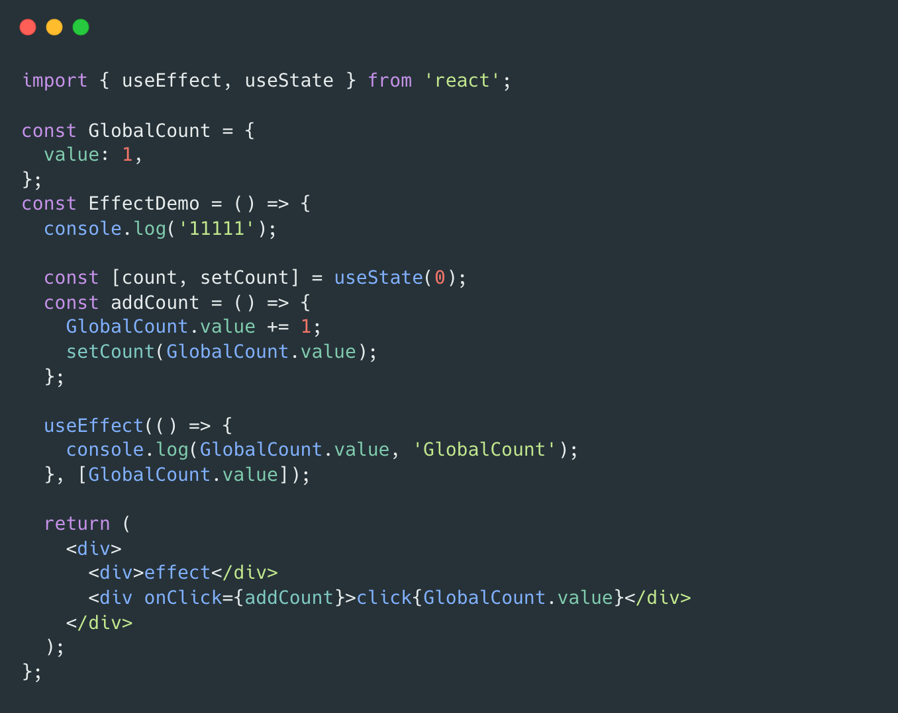
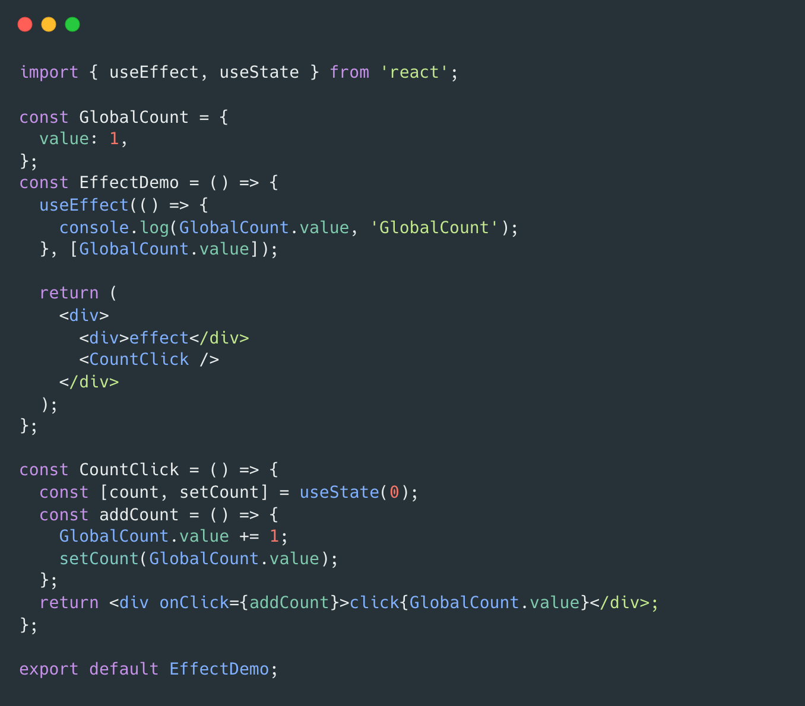

## 如何理解 React hooks 不能再条件、循环语句中使用 ？

指的是 hooks 在组件内部声明时不能在条件语句中使用，因为 hooks 内部的实现，与 hooks 的顺序有关；
并不限制在回调函数中使用 hooks 暴露的 api, 例如 setState；

## Hooks

`useEffect`

useEffect 的回调函数不能是异步函数，原因如下：

- 1、useEffect 的返回值是要在卸载组件时调用的，React 需要在 mount 的时候马上拿到这个值，不然就乱套了

- 2、useEffect() 可能有个潜在逻辑：第二次触发 useEffect 里的回调前，前一次触发的行为都执行完成，返回的清理函数也执行完成。这样逻辑才清楚。而如果是异步的，情况会变得很复杂，可能会很容易写出有 bug 的代码。

useEffect 所监听的依赖项，并不是依赖项的值发生变化，回调函数就会立即执行，而是需要等待组件 rerender 后再判断依赖项是否变化，进而判断是否需要执行；

`useEffect 会执行`

`useEffect 不会执行`
子组件更新了全局变量，通过 setState 只更新了子组件，父组件没有触发重新渲染，因此父组件的 useEffect 不会执行

`useReducer、useContext`

[实现状态管理](https://juejin.cn/post/6995105000523317278)
